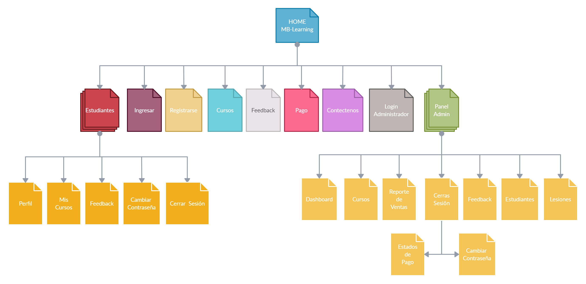
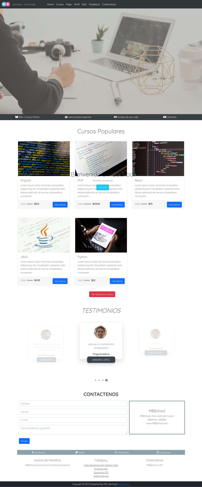
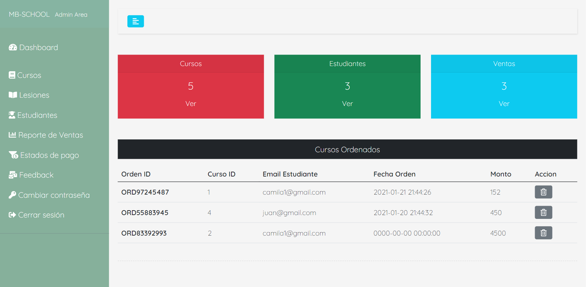
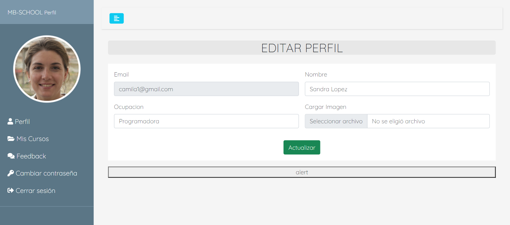
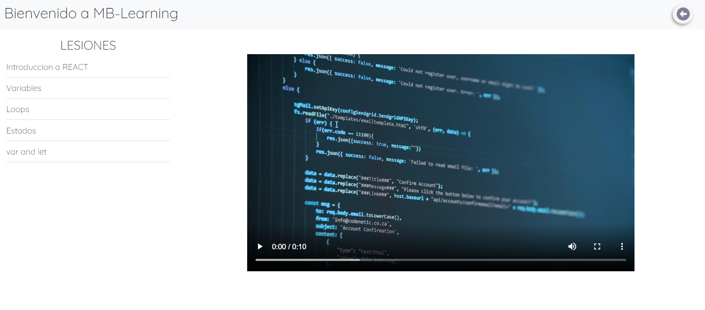

# MB-Learning
Plataforma de cursos, con panel admin junto a Panel de learning para estudiantes

## Distribucion de paginas 

## Pagina Principal

## Panel Admin

## Learning Estudiante

## Area de visualizacion de Cursos

